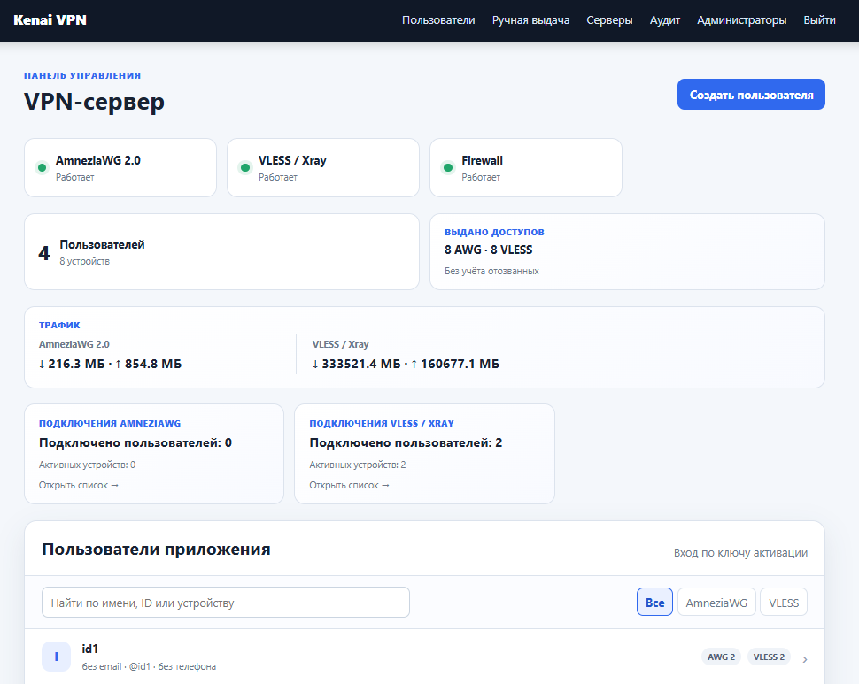

# Kenai VPN — админ-панель

Веб-панель для управления VPN-сервисом: пользователями, устройствами, подписками и доступами **AmneziaWG / VLESS + REALITY**. Построена на **Python и FastAPI**; VPN-трафик обрабатывают AmneziaWG и Xray, а панель настраивает доступ к ним.



## Разделы панели

1. **Обзор** — состояние служб, количество пользователей и устройств, доступная статистика трафика.
2. **Пользователи** — создание пользователя, его устройства, срок подписки, отключение и отзыв доступа.
3. **Ручная выдача** — создание отдельных доступов AmneziaWG/VLESS, выдача конфигурации и QR-кода.
4. **Серверы** — VPN-узлы, их конфигурация, доступность и маршруты подключения.
5. **Аудит** — история административных действий для поиска причин изменений.
6. **Администраторы** — учётные записи, роли, разрешения, пароль и двухфакторная защита TOTP.

В текущем коде также есть метрики, уведомления, поддержка и настройки консоли. Скриншот показывает предоставленную версию интерфейса; оформление актуального кода может отличаться.

## Как выдаёт ключи и управляет сервером

Администратор создаёт пользователя и доступ. Для приложения формируется ключ активации; устройство получает собственные параметры AmneziaWG и/или VLESS. [Windows-клиент](https://github.com/pasha-tsaran/desktop_app) получает их через HTTPS API. Секреты хранятся зашифрованными.

Веб-процесс работает без root. Изменения VPN выполняет отдельный привилегированный **helper** через защищённый Unix-сокет: проверяет запрос, обновляет конфигурацию движка и позволяет отозвать конкретное устройство. Для локальной разработки предусмотрен mock-режим без изменения рабочего сервера.

## Зависимости и запуск

Python 3.12+, FastAPI/Uvicorn, Jinja2, SQLAlchemy, Alembic, PostgreSQL (`psycopg`), Pydantic Settings, Cryptography, Argon2, PyOTP и QRCode. SQLite используется для локальной разработки.

```powershell
python -m venv .venv
.venv\Scripts\Activate.ps1
pip install -e ".[dev]"
Copy-Item .env.example .env
# Заполните .env перед выполнением следующих команд.
alembic upgrade head
kenai-admin create-admin
uvicorn kenai_vpn_admin.main:app --reload
```

В `.env` задайте адрес своей базы, случайный `KENAI_SECRET_KEY` и ключ шифрования Fernet. Шаблон рассчитан на PostgreSQL; для локального SQLite можно указать `KENAI_DATABASE_URL=sqlite:///./kenai.db`. Создать Fernet-ключ: `python -c "from cryptography.fernet import Fernet; print(Fernet.generate_key().decode())"`. Оставьте `KENAI_VPN_BACKEND=mock` для разработки. Локальная панель: `http://127.0.0.1:8000`. Развёртывание, HTTPS и helper: [руководство](DEVELOPMENT.md), [архитектура](docs/architecture.md).

## Проверки

```powershell
ruff format --check .
ruff check .
mypy src
pytest
```

Код разделён на бизнес-логику (`application`/`domain`), хранение и интеграции (`infrastructure`), веб-интерфейс (`web`) и helper. Рабочие ключи, базы и журналы в репозиторий не входят.
